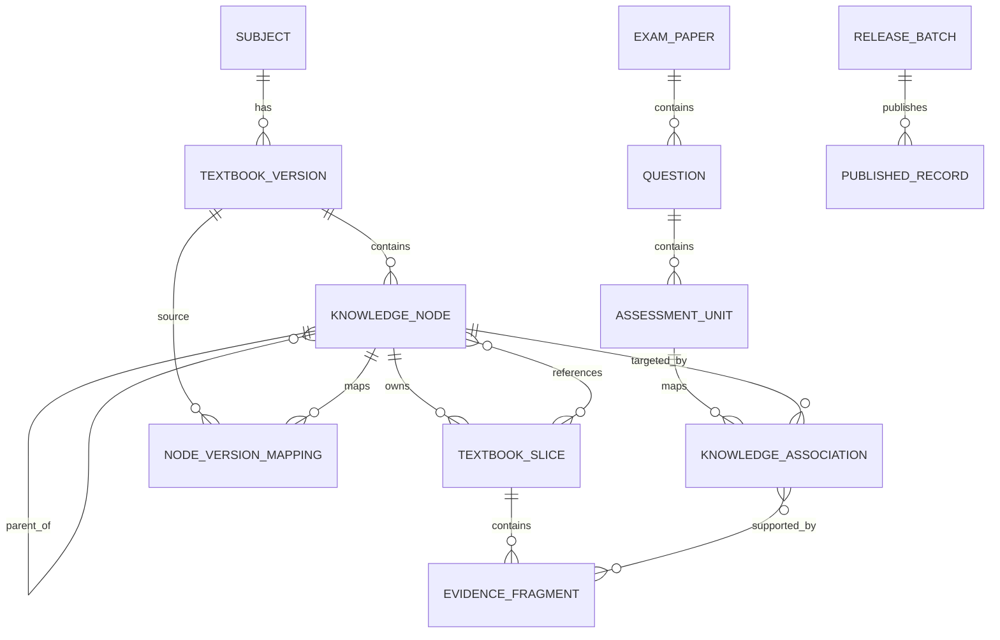

# 教研解析平台领域模型 v0.1

## 1. 模型总览

## 2. 核心实体

### 2.1 科目 Subject

- 科目 ID
- 科目名称
- 状态

### 2.2 教材版本 TextbookVersion

- 教材版本 ID
- 科目 ID
- 版本名称、出版年份
- 原始文件
- 是否最新版
- 解析状态：待解析、待验收、可关联、已停用

### 2.3 知识节点 KnowledgeNode

- 节点 ID
- 教材版本 ID
- 父节点 ID
- 层级类型：篇、章、节、目、条、知识点、子知识点
- 标题名称
- 原始顺序
- 是否叶子节点
- 状态：草稿、生效、停用
- 原始页码及版面位置

约束：

- 每版教材拥有独立知识节点树。
- 最新版叶子节点是大宽表行和正式真题关联的主知识单元。

### 2.4 教材基础切片 TextbookSlice

- 切片 ID
- 教材版本 ID
- 主归属节点 ID
- 内容类型：自然段、表格、图片、公式、流程图
- 结构化内容
- 原始内容快照
- 原始页码与版面位置
- 顺序
- 解析置信度
- 修正状态

### 2.5 精确依据片段 EvidenceFragment

- 片段 ID
- 基础切片 ID
- 起止位置或版面区域
- 原文快照
- 结构化内容
- 片段顺序

一条关联可引用多个精确依据片段。

### 2.6 真题试卷 ExamPaper

- 试卷 ID
- 科目 ID
- 年份、批次
- 来源文件
- 来源可信等级
- 完整度
- 教研确认状态

### 2.7 真题 Question

- 真题 ID
- 试卷 ID
- 题号
- 题型：单选、多选、案例
- 题干
- 标准答案
- 解析
- 原始位置
- 当前有效性
- 重复合并状态

### 2.8 最小考查单元 AssessmentUnit

- 单元 ID
- 真题 ID
- 单元类型：题干、选项、案例得分点
- 内容
- 正误属性
- 分值
- 顺序

### 2.9 知识关联 KnowledgeAssociation

- 关联 ID
- 最小考查单元 ID
- 最新版知识节点 ID
- 原教材版本及原知识节点 ID
- 知识角色：主要、次要、题干涉及
- 考查角色：核心考查、干扰项考查、一般涉及
- 依据角色：直接依据、相关内容、无直接依据
- AI 推荐理由及置信度
- 初审状态、复审状态
- 当前有效性
- 当前数据版本

### 2.10 错误选项解析 DistractorAnalysis

- 最小考查单元 ID
- 错误类型
- 错误文字
- 正确文字
- 补充说明

### 2.11 节点版本映射 NodeVersionMapping

- 来源教材版本及节点
- 目标教材版本及节点
- 映射类型：延续、改名、拆分、合并、新增、删除
- AI 建议
- 教研确认状态

### 2.12 审核记录 ReviewRecord

- 审核对象类型及 ID
- 审核阶段：初审、复审
- 操作类型
- 变更前后快照
- 操作说明
- 操作时间
- 操作人标识

第一期不做权限控制，但保留操作人标识与全部审核记录。

### 2.13 发布批次 ReleaseBatch

- 批次 ID
- 科目、教材版本及真题范围
- 包含的数据版本
- 发布前检查结果
- 状态：草稿、待发布、已发布、已撤销
- 发布时间

## 3. 关键状态流

### 3.1 教材版本状态

`待解析 -> 待验收 -> 可关联 -> 已停用`

### 3.2 关联审核状态

`AI 建议 -> 待初审 -> 初审通过 -> 待复审/待发布 -> 已发布 -> 待更正`

### 3.3 历史真题有效性

`待判断 -> 仍然有效/表述变化/规则变化/内容删除/无法映射`

### 3.4 知识结构调整

`草稿调整 -> 待迁移 -> 待审核 -> 待发布 -> 已生效`

## 4. 关键约束

1. 未达到“可关联”状态的教材版本，不得生成正式 AI 关联建议。
2. 未发布关联不得进入教材预览标注、正式统计及知识图谱。
3. 已发布记录不可直接覆盖，只能通过新数据版本更正。
4. 一个基础切片只有一个主归属节点，可拥有多个引用节点。
5. 一道真题可以关联多个知识点，一个知识点可引用多个依据片段。
6. 最新版知识体系新增子节点后，父节点原关联必须进入待拆分队列。
7. 上级节点统计由叶子节点数据汇总，不直接维护重复关联。
