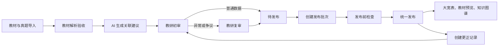

# 教研解析平台 PRD v0.1

## 1. 文档信息

- 产品名称：教研解析平台
- 服务对象：一级建造师教研人员
- 当前阶段：第一期产品基线
- 核心科目范围：选择一个科目，覆盖最新版教材及可获取的全部历史真题
- 产品主流程：按真题审核教材、知识点与考查内容的关联关系

## 2. 产品背景

当前教研工作尚未形成统一的教材、知识体系与历史真题关联流程，相关判断主要依赖个人经验，无法稳定沉淀、复用和统计。

平台需要围绕最新版教材标题树建立知识体系，将教材原文、历史真题及精确考查依据结构化关联，并通过教研审核形成可信数据底座。

## 3. 产品目标

第一期目标：

1. 建立一个科目完整、可追溯的最新版教材知识体系。
2. 结构化收录全部可获取的历史真题。
3. 由 AI 生成知识点与教材依据建议，教研审核后形成正式关联。
4. 以知识体系叶子节点为主表，形成教研大宽表。
5. 支持在教材预览中直观看到被考查内容及关联真题。
6. 建立可用于分析跨章节考查、知识组合和命题规律的知识图谱。

非目标：

- 第一期不考虑用户角色与权限划分。
- 第一期不自动跨科目推荐知识点。
- 未经教研审核和批次发布的数据，不进入正式统计及成果端。

## 4. 核心产品原则

### 4.1 权威来源

- 最新版教材原版文件是教材内容与标题结构的权威底稿。
- 结构化教材内容是可修正的工作副本，必须可回溯至原始页码与版面位置。
- 知识体系本质是教材标题树，层级为：篇、章、节、目、条、知识点、子知识点。
- 子知识点层级可缺失，每条分支的最末端节点为叶子节点。

### 4.2 正式数据

- AI 只生成建议，不直接形成正式数据。
- 普通关联经一名教研确认后有效；异常、争议及高风险关联必须复审。
- 审核通过的数据进入待发布区，负责人按批次统一发布。
- 三个成果端必须使用同一发布版本。
- 已发布数据不可直接覆盖；更正需重新审核并随新批次发布。

## 5. 产品模块

### 5.1 教研关联审核工作台

第一期核心模块，主入口为“按真题审核”。

支持入口：

- 按真题审核：第一期主流程。
- 按知识点审核：用于查漏、复审和查看知识点全貌。
- 按教材章节审核：用于检查教材覆盖与关联完整性。

客观题审核内容：

- 题干及每个选项。
- AI 推荐的 1 个主要知识点和多个次要知识点。
- 每个知识点对应的教材基础切片与精确考查原文。
- 正确选项、错误选项、题干涉及等关联角色。
- 错误选项的错误类型、错误文字、正确文字及补充说明。

案例题审核内容：

- 案例背景、子问题、标准答案。
- AI 拆分的得分点。
- 每个得分点关联的知识点、教材依据和分值。

教研操作：

- 接受、拒绝、修改 AI 建议。
- 手动补充或移除知识点及教材依据。
- 跨自然段选择多个连续或不连续的精确原文片段。
- 提交初审、提交复审、退回修改。
- 标记无直接教材依据。

### 5.2 教研大宽表

主表始终以最新版教材标题树的叶子节点为准，每行代表一个叶子节点。

非叶子节点用于分组、筛选及汇总。

建议字段组：

| 字段组 | 主要内容 |
| --- | --- |
| 知识体系 | 节点 ID、篇、章、节、目、条、知识点、子知识点 |
| 教材内容 | 教材版本、主归属切片、引用切片、原始页码 |
| 考查统计 | 核心考查题数、涉及题数、考查单元数、考查年份数、案例分值 |
| 真题信息 | 年份、题型、题目、最小考查单元、有效性 |
| 审核发布 | 审核状态、异常标记、当前发布版本 |

交互要求：

- 支持按标题树展开、折叠、筛选与定位。
- 点击行可展开教材切片、真题及统计明细。
- 支持导出“知识点主表”和“知识点 × 教材切片 × 真题明细表”。

### 5.3 教材预览

- 还原教材原始阅读顺序和版面。
- 被正式发布真题考查过的精确原文显示标注线。
- 点击标注后查看考查总览及真题明细。
- 默认区分核心考查与一般涉及。
- 明确区分当前有效真题与历史失效、规则变化真题。
- 表格、图片、公式和流程图保留原始版面，并可定位到结构化内容。

### 5.4 知识图谱

第一期主要目的：分析跨章节考查、知识组合和命题规律。

正式事实关系：

- 标题节点上下级关系。
- 知识节点与教材切片的主归属、引用关系。
- 最小考查单元与知识节点、教材依据的关系。
- 不同版本教材知识节点的映射关系。

扩展关系：

- 易混淆。
- 相关知识。
- 组合考查。

组合考查基于已审核真题自动生成，区分：

- 共同核心考查。
- 主次组合考查。
- 选项对比关系。
- 案例场景共现。

叶子节点作为原始计算单位，上级节点关系由叶子关系汇总。汇总时同时保留组合考查题数与关联叶子对数。

## 6. 教材处理规则

### 6.1 教材版本

- 每版教材保留独立标题树。
- 大宽表以最新版教材标题树为主。
- 历史版本节点与最新版节点建立延续、改名、拆分、合并、新增、删除等映射。

### 6.2 教材切片

- 自然段是稳定的基础切片。
- 每个基础切片只有一个由教材标题结构决定的主归属节点。
- 基础切片可以被其他知识节点引用。
- 精确考查原文可以跨多个自然段，由多个连续或不连续片段组成。
- 每个精确片段保存原文位置、原文快照和所属基础切片。

### 6.3 非文本内容

表格、图片、公式和流程图同时保留：

- 原始版面及原始位置。
- 结构化解析内容。
- 原版与结构化内容的位置对应关系。
- AI 识别结果与人工修正记录。

## 7. 真题处理规则

### 7.1 收录范围

- 尽可能完整收录历史真题。
- 记录来源、完整度、可信等级及教研确认状态。
- 争议或残缺真题确认前不参与正式统计。
- 同一道真题存在多个来源时，仅保留可信度最高的正式版本。
- 系统自动识别疑似重复题，由教研确认后合并。
- 正式真题必须可回溯至原始文件、页码和版面位置。

### 7.2 最小考查单元

- 客观题：题干或具体选项。
- 案例题：具体得分点。
- 题目级总览由最小考查单元自动汇总，不重复人工维护。

### 7.3 关联角色

- 主要知识点。
- 次要知识点。
- 题干涉及。
- 核心考查。
- 干扰项考查。
- 直接教材依据。
- 相关教材内容。

### 7.4 错误选项

错误选项需要关联教材依据并结构化记录：

- 错误类型。
- 选项中的错误文字。
- 教材中的正确文字。
- 补充解析说明。

## 8. 历史真题有效性

历史真题映射至最新版知识节点，同时保留原教材版本及原节点信息。

有效性状态：

- 仍然有效。
- 表述变化。
- 规则变化。
- 内容删除。
- 无法映射。

AI 对比原版与最新版教材，提供差异及有效性建议；教研审核确认后生效。规则变化、内容删除和无法映射自动进入复审队列。

## 9. 审核与发布流程

自动进入复审的条件：

- AI 置信度低。
- 一道题关联多个主要知识点。
- 教研大幅修改 AI 建议。
- 无法找到直接教材依据。
- 历史真题发生规则变化、内容删除或无法映射。
- 数据存在争议或异常。

## 10. 知识体系调整

- 教研可以新增、改名、调整层级和停用节点，不允许物理删除正式节点。
- 叶子节点新增子节点后，原关联数据进入待拆分队列。
- AI 提供关联迁移建议，由教研审核确认。
- 结构调整、关联迁移及审核结果作为同一批次统一发布。
- 调整发布前，线上继续使用上一正式版本。

## 11. 统计口径

不使用单一“考查次数”，至少同时保留：

- 核心考查题数。
- 涉及题数。
- 考查单元数。
- 考查年份数。
- 案例累计分值。
- 组合考查题数。
- 关联叶子对数。

## 12. 第一期开工顺序

1. 导入知识体系表格与最新版教材。
2. 比对知识体系表格与教材原版标题树，完成差异修正。
3. 完成教材标题树、自然段、表格、图片、公式和流程图解析验收。
4. 导入、清洗、查重和确认历史真题。
5. 建设客观题按真题审核流程。
6. 建设案例题得分点审核流程。
7. 建设待发布、批次发布和更正流程。
8. 建设大宽表、教材预览和知识图谱成果端。

## 13. 验收框架

具体阈值通过试运行校准，验收至少覆盖：

- 数据质量：教材结构完整率、切片回溯率、真题结构化完整率。
- AI 效果：主要知识点推荐准确率、教材依据推荐准确率。
- 审核质量：正式关联准确率、不同教研判断一致率、返工率。
- 审核效率：客观题及案例题平均审核时间。
- 业务覆盖：最新版教材叶子节点覆盖率、历史真题覆盖率。
- 可追溯性：所有已发布数据均可追溯、可更正、可回退。

## 14. 后续待确认事项

- 第一期开工科目及具体教材版本。
- 历史真题年份边界和现有资料来源。
- AI 推荐准确率与人工审核效率的试运行目标值。
- 教材预览采用原版 PDF 叠加标注，还是重排版阅读模式。
- 知识图谱首批分析报表与展示方式。
- 后续权限体系及科目隔离规则。
